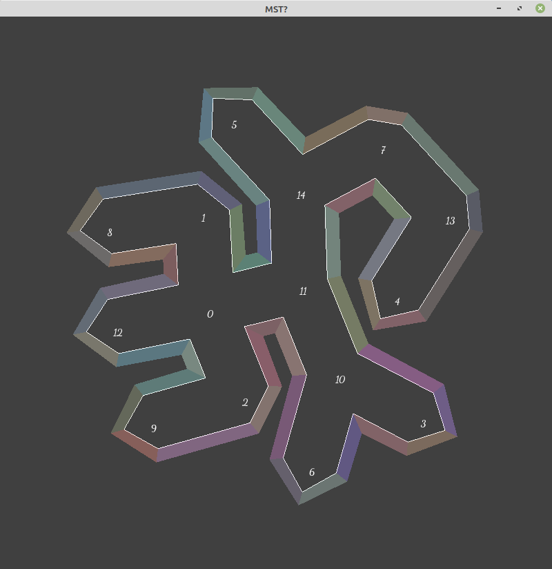

# CaveSystem
work in progress

Not sure if will continue working on this.  Thought of another way to make the caves I need.  But here is an example of what it gets you so far... A Minimum Spanning Tree with non-intersecting borders.
Failing seeds were fixed.
</img>
